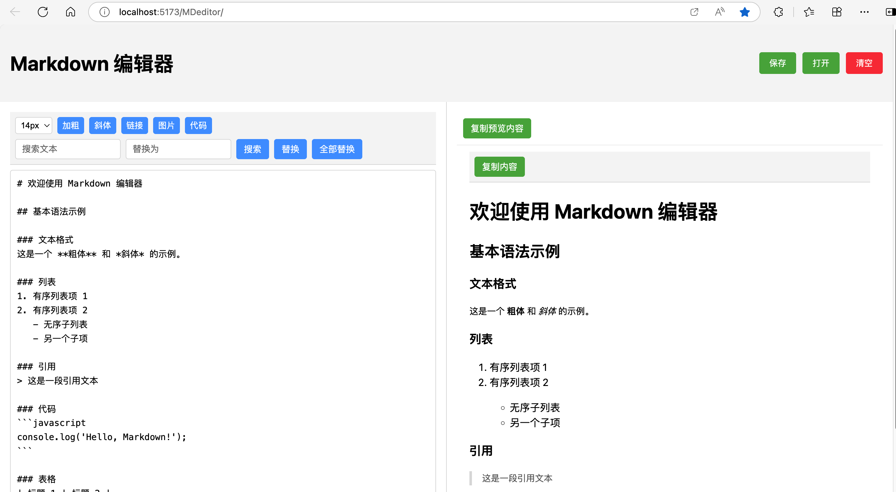

# Markdown 编辑器

一个简洁的网页版 Markdown 编辑器，基于 Vue 3 + Vite 构建，支持实时预览和格式化文本复制。



## 快速开始

```bash
# 克隆项目
git clone https://github.com/ccbsdu/MDeditor.git

# 进入项目目录
cd MDeditor

# 安装依赖
npm install

# 启动开发服务器
npm run dev
```

## 功能特性

- 实时预览 Markdown 渲染效果
- 支持标准 Markdown 语法
- 编辑器与预览窗口同步显示
- 支持文件保存和打开
- 支持复制带格式的预览内容（适用于微信公众号等平台）
- 一键清空编辑器内容
- 预览窗口段落文本统一 14px 字号

## 技术栈

- Vue 3
- Vite
- CodeMirror 6 (编辑器)
- markdown-it (Markdown 解析)


## 项目结构

```
MDeditor/
├── src/
│   ├── components/
│   │   ├── Editor.vue    # Markdown 编辑器组件
│   │   └── Preview.vue   # 预览渲染组件
│   ├── App.vue           # 主应用组件
│   ├── main.js          # 应用入口文件
│   └── style.css        # 全局样式文件
├── index.html           # HTML 模板
└── package.json         # 项目配置文件
```

## 使用说明

### 基本操作
1. 在左侧编辑器中输入 Markdown 文本
2. 右侧窗口实时显示渲染效果
3. 编辑器支持标准 Markdown 语法

### 工具栏功能
- 保存：将当前内容保存为 .md 文件
- 打开：打开本地 Markdown 文件
- 清空：一键清空编辑器内容
- 复制：复制预览区域的带格式内容

### Markdown 语法支持
- 标题（H1-H6）
- 粗体、斜体
- 有序、无序列表
- 链接和图片
- 代码块
- 表格
- 引用

## 注意事项

- 复制功能会保留文本格式，特别适合粘贴到微信公众号等富文本编辑器中
- 保存的文件默认使用 .md 扩展名
- 预览窗口中段落文本统一使用 14px 字号，标题大小保持默认值
- 建议使用现代浏览器（Chrome、Firefox、Safari 等）以获得最佳体验

## 开发计划

- [ ] 添加深色主题支持
- [ ] 增加更多 Markdown 扩展语法支持
- [ ] 添加自定义样式配置
- [ ] 优化移动端适配
```