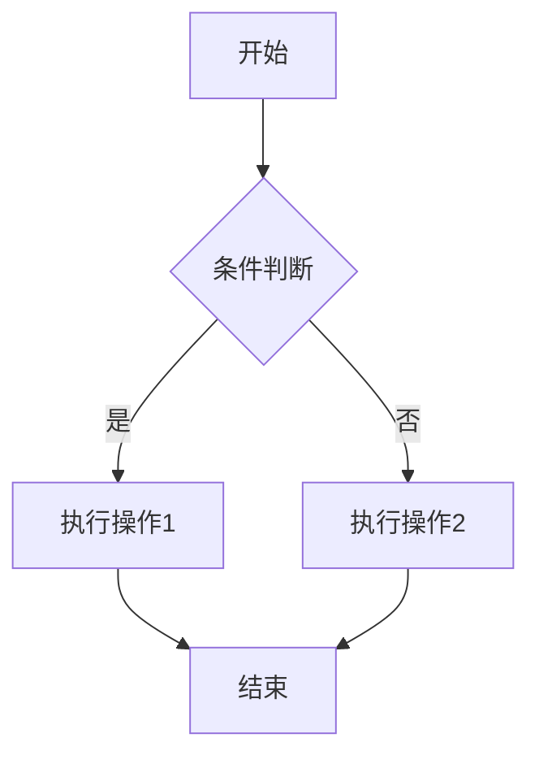
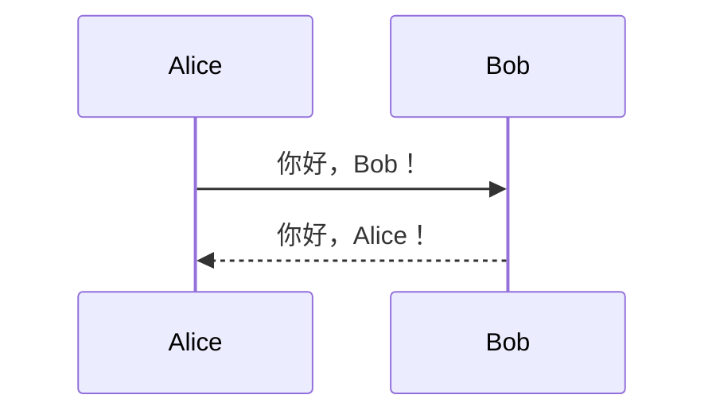

# Markdown 编辑器

一个功能强大的 Markdown 编辑器，支持实时预览、LaTeX 公式和 Mermaid 图表。


## 功能特点

- ✨ 实时预览 Markdown 内容
- 📐 支持 LaTeX 数学公式
- 📊 支持 Mermaid 流程图和时序图
- 🎨 支持代码高亮
- 🔍 支持搜索和替换
- 📝 字体大小可调整
- 🛠 快捷工具栏

## 安装

```bash
# 克隆项目
git clone https://github.com/yourusername/MDeditor.git
cd MDeditor

# 安装基础依赖
npm install

# 安装额外依赖
npm install marked@4.2.12 katex mermaid
```
## 使用示例
### LaTeX 公式
行内公式： $E = mc^2$ 独立公式：

```latex
$$
\int_{-\infty}^{\infty} e^{-x^2} dx = \sqrt{\pi}
$$
 ```

### LaTeX 公式支持


### Mermaid 图表
流程图：



 

时序图：



 ```

### 编辑器功能
- 格式化工具栏 ：快速插入常用的 Markdown 语法
- 字体大小调整 ：支持 12px-18px 的字体大小调整
- 搜索替换 ：支持文本搜索和替换功能
- 实时预览 ：编辑时即时预览渲染效果
## 开发
```bash
# 启动开发服务器
npm run dev

# 构建生产版本
npm run build
 ```

## 项目结构
```plaintext
MDeditor/
├── src/
│   ├── components/
│   │   └── editor.vue      # 编辑器组件
│   ├── App.vue             # 主应用组件
│   └── main.js            # 入口文件
├── public/
├── screenshots/           # 项目截图
└── package.json
 ```

## 技术栈
- Vue 3
- Marked.js - Markdown 解析
- KaTeX - LaTeX 公式渲染
- Mermaid - 图表渲染
## 许可证
MIT License

